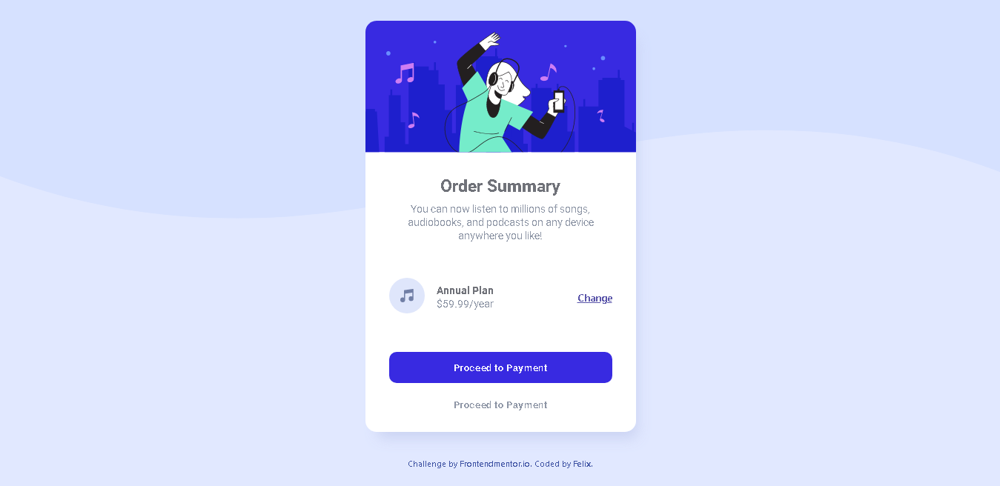

# Frontend Mentor - Order summary card solution

  

This is a solution to the [Order summary card challenge on Frontend Mentor](https://www.frontendmentor.io/challenges/order-summary-component-QlPmajDUj). Frontend Mentor challenges help you improve your coding skills by building realistic projects.

  

## Table of contents

  

-  [Overview](#overview)

-  [The challenge](#the-challenge)

-  [Screenshot](#screenshot)

-  [Links](#links)

-  [My process](#my-process)

-  [Built with](#built-with)

-  [What I learned](#what-i-learned)

-  [Continued development](#continued-development)

-  [Useful resources](#useful-resources)

-  [Author](#author)

-  [Acknowledgments](#acknowledgments)

  

**Note: Delete this note and update the table of contents based on what sections you keep.**

  

## Overview

  

### The challenge

  

Users should be able to:

  

- See hover states for interactive elements

  

### Screenshot

  



  


  

### Links

  

- Solution URL: [Add solution URL here](https://your-solution-url.com)

- Live Site URL: [Add live site URL here](https://your-live-site-url.com)

  

## My process

  

### Built with

  

- Semantic HTML5 markup

- CSS custom properties

- Flexbox

- SCSS

- Mobile-first workflow

-  [React](https://reactjs.org/) - JS library

-  [Next.js](https://nextjs.org/) - React framework

-  [Styled Components](https://styled-components.com/) - For styles

  

  

### What I learned

  

I have learned how to create a mobile-first design using pure CSS in React JS and also I have learned how to style the app using SCSS. I was able to create my custom Button using Styled Components.


  

```html

<Button  primary  className="CardSummary__proceed">Proceed to Payment</Button>

<Button  className="CardSummary__cancel">Cancel Order</Button>

```

```jsx

const  Button = styled.button`

/* Adapt the colors based on primary prop */

background: ${props  =>  props.primary ? "#382AE1" : "none"};

color: ${props  =>  props.primary ? "white" : ""};

border: none;

`;

```
I have learned how to create simple custom modal in React JS
```js

const [openModal, setOpenModal] = useState(true);
const  handleSubmit = (e) => {
e.preventDefault();
setOpenModal(true)
}

{

openModal ? (

<div  className="CardButtons__modal">

<div  className="CardButtons__modal-content">

<div  className="CardButtons__modal-content-header">

<h1>Thank You For Your Purchase.</h1>

</div>

  

{/* <!-- Card-plan --> */}

<div  className="CardSummary__card-plan-container CardButtons__modal-card-plan">
	<div  className="CardSummary__card-plan">
		<div  className="CardSummary__card-plan-image">
				
			</div>
			<div  className="CardSummary__card-plan-text">
				<h4>Annual Plan</h4>
				<p>$59.99/year</p>
			</div>
		</div>
	</div>
		<Button  type="button"  onClick={() =>  setOpenModal(false)}  className="CardSummary__cancel CardButtons__modal-button">Checkout</Button>
	</div>
</div>
) : (
	null
	)
}
```

  


### Continued development

  

I want to continue what I have learned from this Code Challenge to develop my skills  and gain more knowledge to be a productive Web Developer

 

### Useful resources

  

-  [Custom Modal](https://codesandbox.io/s/modal-window-component-with-hooks-vb6de?fontsize=14&file=/src/index.js) - This helped me achieve my goal in creating custom modal. I really liked this pattern and will use it going forward.

-  [Box-Shadow Generator](https://html-css-js.com/css/generator/box-shadow/) - This is an amazing site where you can easily generate box-shadow and I have been using it for a long time. I'd recommend it to anyone still learning this concept.

-  [# Learn Sass In 20 Minutes | Sass Crash Course](https://www.youtube.com/watch?v=Zz6eOVaaelI) - This is the YouTube video where I have learned how to use SASS and I am already using it for a ong time. I'd recommend it to anyone still learning this concept.
  

## Author

  

- Website - [Add your name here](https://felixdiaz.netlify.app/)

- Frontend Mentor - [@zaids2641](https://www.frontendmentor.io/profile/zaids2641)

- Twitter - [@zaids2641](https://www.twitter.com/zaids2641)

  

  

## Acknowledgments

  

I would like to say thank you to [Sonny Sangha](https://www.instagram.com/ssssangha/) for sharing his professional knowledge in Wed Development using React JS, Next.js with Tailwind CSS, and Mapbox and also to Frontendmentor.io where I can expose and share my knowledge and skills in Web Development.